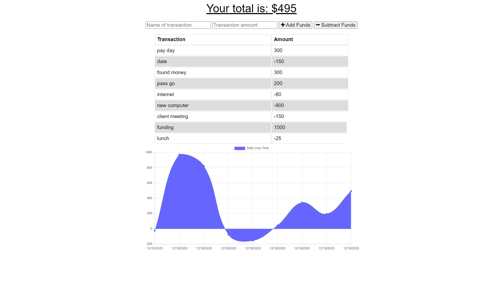

   # Budget Tracker
   
   
   ## Description 
   Simple budgeting app to keep track of your transactions and keep an eye on your funds. Server made with Express.js. PWA, works offline!!!!

   

   ## Table of Contents

    
  * [Usage](#usage)

  * [Credits](#credits)

  * [Licenses](#license)

  * [Testing](#test)

  * [Questions](#questions)
      

   ## Usage 
  Input the name of the transaction, the amount, and then either add or subtract the funds.  
  Click <a href="https://vast-retreat-17080.herokuapp.com/">here</a> to get your finances in line!

   ## Credits  
  Express, MongoDB, Mongoose
   
   ## License
   This application is covered under the MIT license
         
   
   ## Contributing
  NA
      
   ## Testing
  NA
   
   ## Questions
  #### <a href="https://www.github.com/napo-100">GitHub</a>
  #### Michaeljnapolitano@gmail.com
   
 